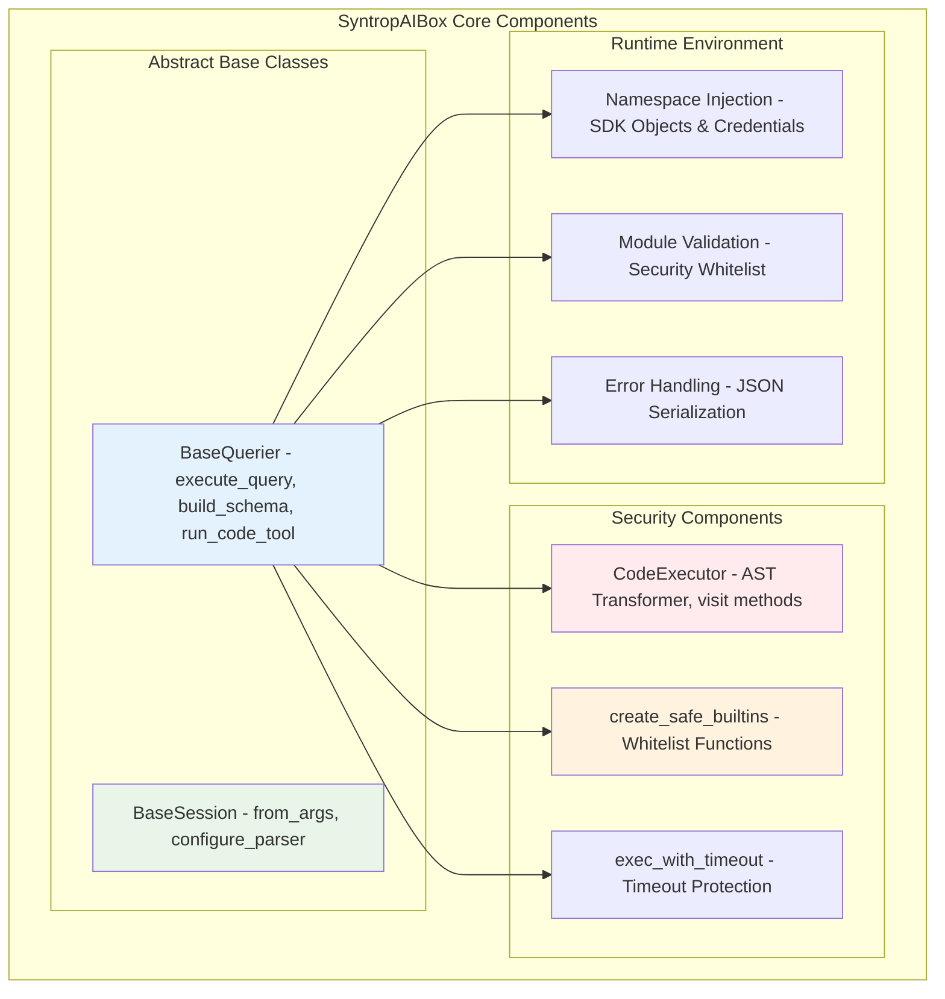
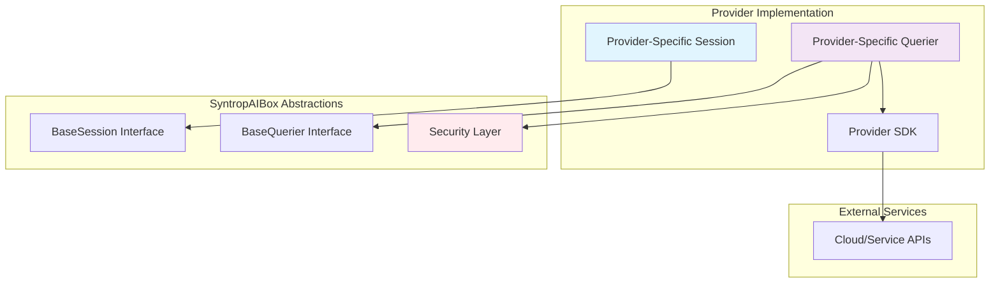
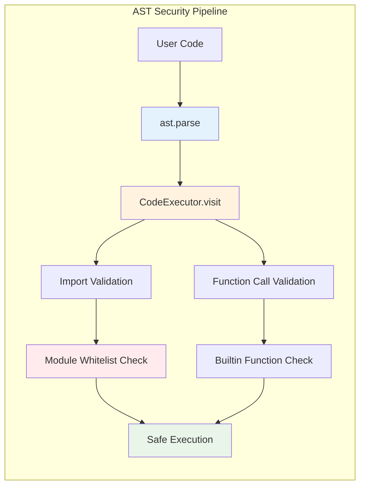
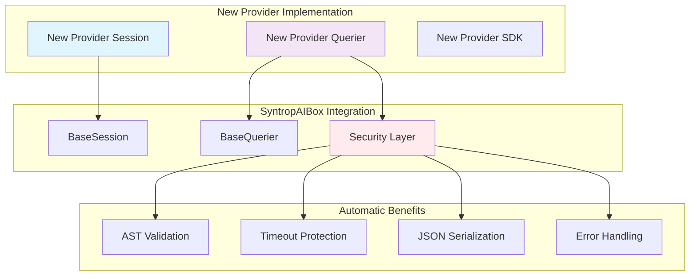
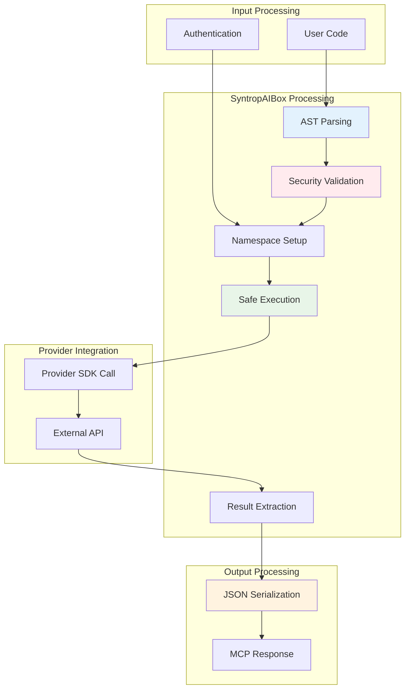
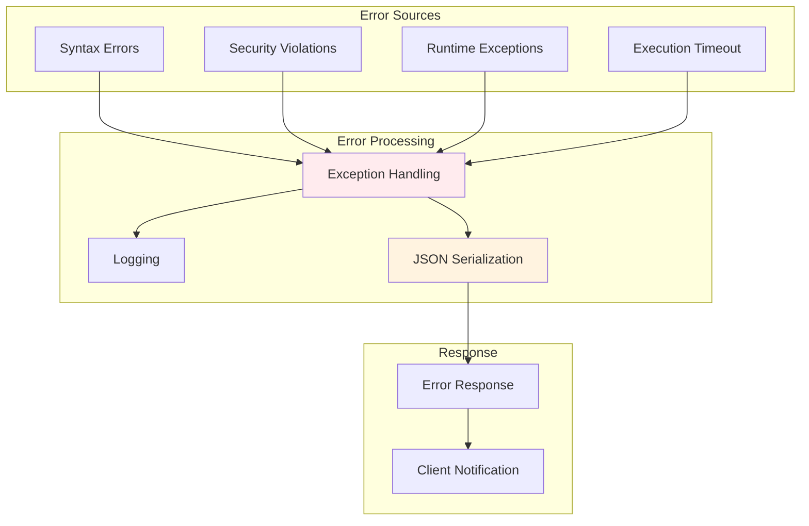

# SyntropAIBox - Core Library Architecture

## System Overview

SyntropAIBox provides the foundational abstractions for creating secure, provider-agnostic MCP servers. The library implements a sophisticated security-first architecture that enables dynamic service access without hardcoded limitations.

## Core Architecture Diagrams

### Security Execution Pipeline

```mermaid
graph TB
    subgraph "User Input"
        UI[User Code Snippet]
    end
    
    subgraph "SyntropAIBox Security Layer"
        AST[AST Parser - Python ast.parse]
        VAL[Code Validator - visit_Call, visit_Import]
        WL[Whitelist Check - Allowed Modules & Functions]
        NS[Safe Namespace - Controlled Builtins]
        TO[Timeout Protection - Signal Handler]
    end
    
    subgraph "Execution Environment" 
        EXEC[Sandboxed exec()]
        RESULT[Extract result Variable]
    end
    
    subgraph "Response Processing"
        SER[JSON Serialization]
        ERR[Error Handling]
    end
    
    UI --> AST
    AST --> VAL
    VAL -->|Valid| WL
    VAL -->|Invalid| ERR
    WL -->|Approved| NS
    WL -->|Blocked| ERR
    NS --> TO
    TO --> EXEC
    EXEC --> RESULT
    RESULT --> SER
    SER --> ERR
    
    style VAL fill:#ffebee
    style WL fill:#fff3e0
    style TO fill:#f3e5f5
    style ERR fill:#fce4ec
```

### Core Component Architecture



### Provider Implementation Pattern



## Key Design Patterns

### 1. Abstract Factory Pattern
```python
class BaseSession(ABC):
    @classmethod
    @abstractmethod
    def from_args(cls, args: argparse.Namespace) -> "BaseSession":
        """Factory method for session creation"""
        pass
```

### 2. Template Method Pattern
```python  
class BaseQuerier:
    def execute_query(self, code_snippet: str) -> str:
        # Template method defining execution pipeline
        tree = ast.parse(code_snippet)
        executor = CodeExecutor()
        executor.visit(tree)
        # ... validation and execution steps
```

### 3. Visitor Pattern
```python
class CodeExecutor(ast.NodeTransformer):
    def visit_Import(self, node):
        # Validate imports
        
    def visit_Call(self, node):
        # Validate function calls
```

## Security Architecture

### AST-Based Validation

The security model is built on Abstract Syntax Tree analysis:



### Security Layers

1. **Syntax Validation**: Ensure valid Python syntax
2. **Import Control**: Only whitelisted modules allowed
3. **Function Restrictions**: Dangerous functions blocked
4. **Execution Limits**: Timeout and resource constraints
5. **Output Sanitization**: Safe JSON serialization

### Whitelisting Strategy

```python
# Default allowed modules
DEFAULT_ALLOWED_MODULES = {
    "operator", "json", "datetime", "pytz", "dateutil", 
    "re", "time", "sys", "base64", "pydantic", "pandas"
}

# Safe built-in functions
DEFAULT_BUILTINS_WHITELIST = [
    "dict", "list", "tuple", "set", "str", "int", "float", "bool",
    "len", "max", "min", "sorted", "filter", "map", "sum", "any", "all"
]
```

## Provider Extension Model

### Adding New Providers



### Extension Steps

1. **Implement BaseSession**: Handle authentication
2. **Implement BaseQuerier**: Set up namespace and SDK
3. **Define Allowed Modules**: Configure security whitelist
4. **Test Integration**: Verify security and functionality

## Data Flow Architecture



## Performance Considerations

### Execution Efficiency
- **AST Caching**: Parse trees cached for repeated code
- **Namespace Reuse**: Provider sessions cached
- **Lazy Loading**: SDKs loaded on demand
- **Memory Management**: Controlled execution environment

### Security vs Performance Trade-offs
- AST parsing adds ~5ms overhead
- Timeout protection uses signals
- Namespace isolation prevents memory leaks
- JSON serialization handles large objects

## Error Handling Strategy



## Extensibility Points

### 1. Custom Security Rules
```python
class CustomCodeExecutor(CodeExecutor):
    def visit_Call(self, node):
        # Add custom validation logic
        return super().visit_Call(node)
```

### 2. Provider-Specific Namespaces
```python  
class CustomQuerier(BaseQuerier):
    def __init__(self):
        namespace = {
            "custom_sdk": custom_library,
            "helper_functions": utility_module,
        }
        super().__init__(allowed_prefixes, modules, namespace)
```

### 3. Enhanced Error Handling
```python
def custom_error_handler(exception):
    # Custom error processing
    return enhanced_error_response(exception)
```

## Future Enhancements

- **Plugin System**: Dynamic provider loading
- **Caching Layer**: Result and AST caching
- **Metrics Collection**: Performance monitoring
- **Advanced Security**: ML-based threat detection
- **Multi-Language Support**: JavaScript, Go execution

---

This architecture provides the foundation for secure, scalable, and maintainable MCP server implementations across any cloud provider or external service.