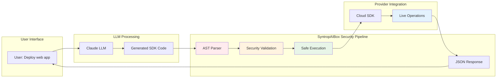

# SyntropAIBox - Core MCP Abstraction Library

**The foundational library powering the [SyntropAI MCP Ecosystem](https://github.com/simplificare-org/syntropai-mcp-ecosystem)**

[](https://test.pypi.org/project/syntropaibox/)
[](https://test.pypi.org/project/syntropaibox/)
[](https://opensource.org/licenses/MIT)

SyntropAIBox is the core abstraction library that enables secure, unified access to cloud services and external APIs through Model Context Protocol (MCP) servers. It provides the foundation for creating provider-agnostic, secure, and extensible MCP implementations.

## 🚀 Key Features

### 🔒 Security-First Architecture
- **AST-Based Validation**: Prevents code injection through abstract syntax tree analysis
- **Sandboxed Execution**: Controlled runtime environment with timeout protection
- **Whitelisted Imports**: Only approved modules and functions are accessible
- **Safe Builtins**: Restricted built-in function access
- **Execution Timeout**: 2-second default timeout with signal-based interruption
- **Memory Protection**: Controlled namespace prevents memory leaks

### 🌐 Universal SDK Transformation
- **BaseSession**: Unified authentication pattern across any Python SDK
- **BaseQuerier**: Secure code execution engine with provider flexibility
- **Dynamic Schema Generation**: Runtime API documentation creation
- **Extensible Architecture**: Easy addition of new cloud providers and services
- **Non-Hardcoded Service Catalog**: Supports any service through dynamic SDK access
- **Future-Proof Design**: New services work immediately without updates

### ⚡ Production-Ready Features
- **Timeout Protection**: Prevents runaway code execution
- **Error Handling**: Comprehensive exception management with JSON serialization
- **Logging Integration**: Built-in logging for debugging and monitoring
- **Type Safety**: Full Pydantic integration for data validation
- **Docker Ready**: Container-friendly design for deployment
- **MCP Protocol**: Native Model Context Protocol support

## 🏗️ Core Architecture

### Natural Language to Operations Flow



### Security Execution Pipeline

```
User Code → AST Parser → Security Validation → Safe Execution → JSON Response
     ↓           ↓              ↓                    ↓              ↓
Input Validation → Whitelist Check → Namespace Setup → SDK Call → Serialization
```

### Key Components

#### BaseQuerier
The core query execution engine that provides:
- **Secure Code Parsing**: AST-based validation of Python code
- **Dynamic Namespace Injection**: Runtime SDK and credential injection
- **Safe Execution**: Sandboxed execution with timeout protection
- **Result Serialization**: JSON conversion with error handling
- **Schema Generation**: Dynamic MCP tool schema creation

#### BaseSession  
Abstract session management for:
- **Provider-Agnostic Authentication**: Unified auth pattern across any SDK
- **Credential Handling**: Secure credential management
- **Configuration Management**: CLI and environment argument parsing
- **Factory Pattern**: Consistent instantiation across providers

#### Security Sandbox (CodeExecutor)
AST-based security layer featuring:
- **Import Validation**: Whitelist-based module approval
- **Function Call Filtering**: Prevention of dangerous operations
- **Execution Time Limits**: Signal-based timeout protection
- **Memory Protection**: Controlled execution environment
- **Result Variable Tracking**: Ensures proper result assignment

## 📦 Installation

### From TestPyPI
```bash
pip install -i https://test.pypi.org/simple/ syntropaibox
```

### With Extra Index (Recommended)
```bash
pip install -i https://test.pypi.org/simple/ syntropaibox --extra-index-url https://pypi.org/simple
```

### Development Installation
```bash
git clone https://github.com/simplificare-org/syntropai-mcp-ecosystem
cd syntropai-mcp-ecosystem/syntropaibox
pip install -e .

# Run tests
pytest

# Build package
python -m build
```

## 🔧 Usage Examples

### Basic Provider Implementation

```python
from syntropaibox.mcp.base import BaseQuerier, BaseSession, DEFAULT_ALLOWED_MODULES
import argparse

class MyCloudSession(BaseSession):
    def __init__(self, api_key: str):
        self.api_key = api_key
    
    @classmethod
    def configure_parser(cls, parser: argparse.ArgumentParser):
        parser.add_argument('--api-key', required=True)
    
    @classmethod  
    def from_args(cls, args: argparse.Namespace) -> "MyCloudSession":
        return cls(api_key=args.api_key)

class MyCloudQuerier(BaseQuerier):
    def __init__(self):
        session = MyCloudSession.from_args(args)
        
        namespace = {
            "mycloud": my_cloud_sdk,
            "session": session,
        }
        
        allowed_prefixes = ("mycloud",)
        custom_modules = DEFAULT_ALLOWED_MODULES.union({"mycloud"})
        
        super().__init__(allowed_prefixes, custom_modules, namespace)
```

### Secure Code Execution

```python
from syntropaibox.mcp.base import BaseQuerier

querier = MyCloudQuerier()

# Safe execution of user code
code_snippet = """
import mycloud
client = mycloud.Client(session.api_key)
result = client.list_resources()
"""

result = querier.execute_query(code_snippet)
print(result)  # JSON serialized response
```

### Custom Security Rules

```python
from syntropaibox.mcp.sandbox import CodeExecutor

class CustomExecutor(CodeExecutor):
    def visit_Call(self, node):
        # Add custom function restrictions
        if isinstance(node.func, ast.Name) and node.func.id == "dangerous_function":
            raise ValueError("Function not allowed")
        return super().visit_Call(node)
```

## 🛡️ Security Features

### AST Validation Pipeline
1. **Syntax Parsing**: Code is parsed into Abstract Syntax Tree
2. **Import Analysis**: All imports are validated against whitelist
3. **Function Validation**: Dangerous functions are blocked
4. **Execution**: Code runs in controlled namespace with timeout

### Whitelisted Modules
Default allowed modules include:
```python
DEFAULT_ALLOWED_MODULES = {
    "operator", "json", "datetime", "pytz", "dateutil", 
    "re", "time", "sys", "base64", "pydantic", "pandas"
}
```

### Safe Builtins
Only safe built-in functions are available:
```python
DEFAULT_BUILTINS_WHITELIST = [
    "dict", "list", "tuple", "set", "str", "int", "float", "bool",
    "len", "max", "min", "sorted", "filter", "map", "sum", "any", "all",
    "__import__", "hasattr", "getattr", "isinstance", "print"
]
```

## 🌟 Ecosystem Integration

### Supported MCP Servers
- **[AWS MCP Server](https://github.com/simplificare-org/mcp-server-for-aws)**: Amazon Web Services integration
- **[Azure MCP Server](https://github.com/simplificare-org/mcp-server-azure)**: Microsoft Azure integration
- **[OCI MCP Server](https://github.com/simplificare-org/mcp-server-oci)**: Oracle Cloud Infrastructure integration
- **[Finviz MCP Server](https://github.com/simplificare-org/mcp_finviz)**: Financial data integration
- **[OSCAL MCP Server](https://github.com/simplificare-org/mcp-server-oscal)**: Security compliance integration

### Extension Pattern
```python
# Easy to extend for new providers
class NewCloudQuerier(BaseQuerier):
    def __init__(self):
        # Provider-specific setup
        namespace = {"newsdk": new_cloud_sdk}
        allowed_prefixes = ("newsdk",)
        super().__init__(allowed_prefixes, custom_modules, namespace)
```

## 📋 Requirements

- **Python**: >= 3.10
- **Core Dependencies**:
  - `hatch >= 1.14.1` - Build system and project management
  - `httpx >= 0.28.1` - Modern HTTP client for API calls
  - `pandas >= 2.3.1` - Data manipulation and analysis
  - `pydantic >= 2.11.7` - Data validation and serialization
  - `pd >= 0.0.4` - Additional data processing utilities

### Optional Dependencies for Specific Providers
- **AWS**: `boto3 >= 1.34.0` for AWS services
- **Azure**: `azure-identity, azure-mgmt-*` for Azure services  
- **Oracle Cloud**: `oci >= 2.100.0` for OCI services
- **Financial**: `finvizfinance >= 0.14.0` for market data

## 🏆 Technical Advantages

### Revolutionary Capabilities
- 🚀 **Natural Language Operations**: Users execute complex tasks through conversation
- 🔄 **Universal SDK Transformation**: Any Python SDK becomes AI-accessible
- 🛡️ **Enterprise Security**: AST-based validation with sandboxed execution
- 🌐 **Provider Agnostic**: Same interface across all cloud providers and services
- ⚡ **Real-Time Execution**: LLM agents perform live operations autonomously
- 🔮 **Future Proof**: New services work immediately without code changes

### Compared to Traditional Approaches
- ✅ **No Coding Required**: Business users operate infrastructure through natural language
- ✅ **Dynamic Service Support**: No hardcoded service catalogs or API limitations
- ✅ **Security by Design**: AST validation prevents code injection attacks
- ✅ **Complete SDK Access**: Unlike code assistants, enables full operational capabilities
- ✅ **Production Ready**: Timeout protection, comprehensive error handling, logging
- ✅ **Vendor Independence**: Easy switching between cloud providers

### Architecture Benefits
- **Clean Abstractions**: Clear separation between security, execution, and provider logic
- **Extensible Design**: Plugin-based architecture for unlimited SDK integration
- **Type Safety**: Full Pydantic integration for data validation
- **Memory Efficient**: Controlled execution environment prevents resource leaks
- **Container Ready**: Docker-friendly design for scalable deployment

## 📚 Documentation

- **[Complete Ecosystem Documentation](https://github.com/simplificare-org/syntropai-mcp-ecosystem)**
- **[Architecture Diagrams](./ARCHITECTURE.md)**
- **[Main Project Architecture](https://github.com/simplificare-org/syntropai-mcp-ecosystem/blob/main/ARCHITECTURE.md)**
- **API Reference**: Coming soon

## 🤝 Contributing

We welcome contributions! Please see our [contributing guidelines](CONTRIBUTING.md).

### Development Setup
```bash
git clone https://github.com/simplificare-org/syntropai-mcp-ecosystem
cd syntropai-mcp-ecosystem/syntropaibox
pip install -e .
pytest
```

## 📄 License

This project is licensed under the MIT License - see the [LICENSE](LICENSE) file for details.

## 📞 Support & Contact

- **Main Documentation**: [SyntropAI MCP Ecosystem](https://github.com/simplificare-org/syntropai-mcp-ecosystem)
- **Organization**: [Simplificare](https://about.simplificare.ch)
- **GitHub**: [simplificare-org](https://github.com/simplificare-org)
- **Package**: [TestPyPI](https://test.pypi.org/project/syntropaibox/)

## 🔗 Related Links

- **[SyntropAI Ecosystem](https://github.com/simplificare-org/syntropai-mcp-ecosystem)**: Complete project overview
- **[Architecture Documentation](https://github.com/simplificare-org/syntropai-mcp-ecosystem/blob/main/ARCHITECTURE.md)**: Detailed system design
- **Individual MCP Servers**: AWS, Azure, OCI, Finviz, OSCAL implementations

---

*SyntropAIBox represents the cutting edge of secure, extensible MCP server development, providing the foundation for next-generation cloud service abstractions.*